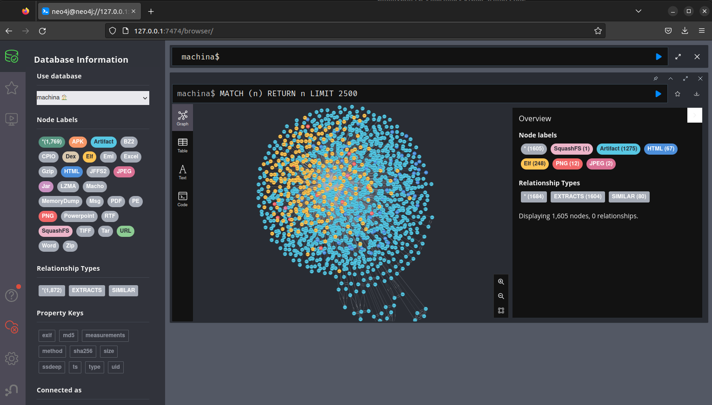

Submission
===================================

CLI Installation
-----------------------------------

It is recommended to set up and use a Python 3 virtual environment to 
isolate dependency installation. Install `virtualenv <https://python-guide-cn.readthedocs.io/en/latest/dev/virtualenvs.html>`_.

.. code-block:: bash

    virtualenv -p python3 machina-cli
    source machina-cli/bin/activate

CLI installation

.. code-block:: bash

    cd machina/cli/
    python setup.py install

Submission
-----------------------------------

.. code-block:: bash

    python3 bin/machinacli.py --help
    usage: machinacli.py [-h] [--verbose] {submit} ...

    positional arguments:
    {submit}
        submit       submit a file

    options:
    -h, --help     show this help message and exit
    --verbose, -v

Optionally, you can publish your own message to the RabbitMQ Server, with the routing key set to 'Identifier' and a JSON body containing a base-64 encoded payload like the following:

.. code-block:: json

    {"data":  "<b64encoded_data>"}

Or, to assert a type (must be available in the 'available_types' configuration within types.json), forcing the Identifier to skip type resolution and accept your own:

.. code-block:: json

    {
        "data": "<b64encoded_data>",
        "type": "apk"
    }

Example
-----------------------------------

Obtain a sample of a jffs2 file system:

.. code-block:: bash

    wget https://github.com/ehrenb/machina-test/blob/main/data/squashfs/firmware.squashfs

Submit the file

.. code-block:: bash

    python3 bin/machinacli.py submit firmware.squashfs

After several minutes, all files in the submitted squashfs file are extracted and stored in Neo4J:

