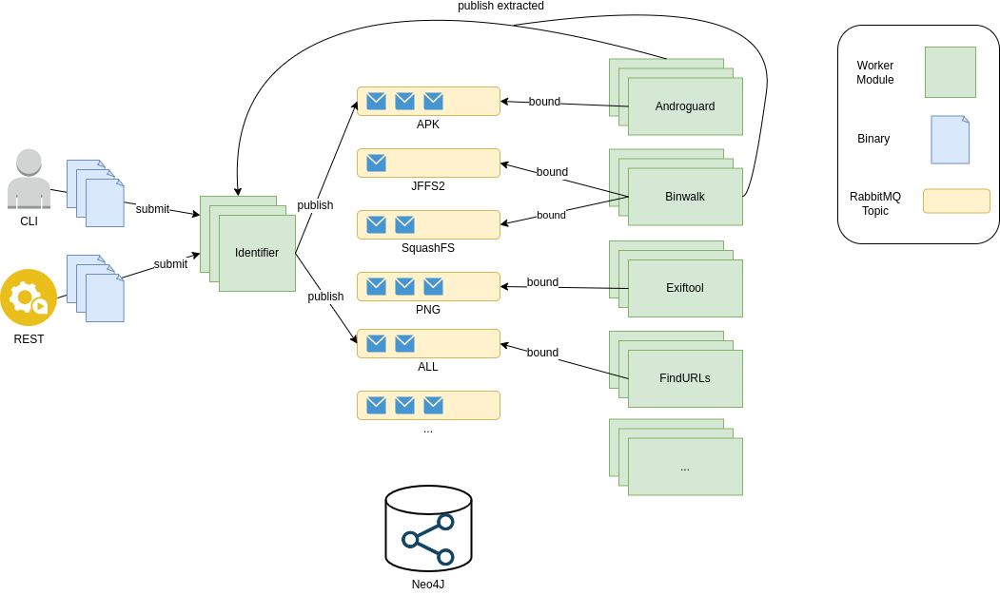

# Welcome to the Machina documentation

Machina is a scalable and modular analysis framework.  
This framework enables rapid integration of both existing open source and novel analysis as worker modules. 

Machina's key features

* **automated identification of input data** - Machina's Identifier worker module classifies input data.  Optionally, a subject matter expert can provide a data type with their data if they wish
* **modular worker development** - A Worker base class provides boilerplate functionality, enabling developers to focus only on their analysis implementation
* **recursive analysis** - Worker modules may publish data back to the entrypoint of the system (Identifier).  This allows for recursive extraction (firmware, archives, compressed data) of data, or re-typing of data after initial triage.
* **graph storage** - Machina uses a graph storage to store input and discovered analysis objects (as nodes), and their relations with other nodes as edges.  For example: edges between nodes can represent origin ("extracted from") or similarity

Machina uses RabbitMQ for message passing  into and within the system.  

Each Machina Worker Module gets its own queue for direct publishing of data. More importantly, each Worker module also subscribes to topic(s) which
correspond to abstract file types (e.g. an apk, pe, elf, etc..). This allows for a Worker Module to receive and handle any or all supported abstract file types.  
When data is submitted to the pipeline (directly to the Identifier queue), the Identifier deteremines its type and publishes 
a message with the classified type as the routing key.  This message is consumed by all Worker Modules that are configured to support that type.  The Identifier
prioritizes "detailed type" data over "mimetype" for classification.

