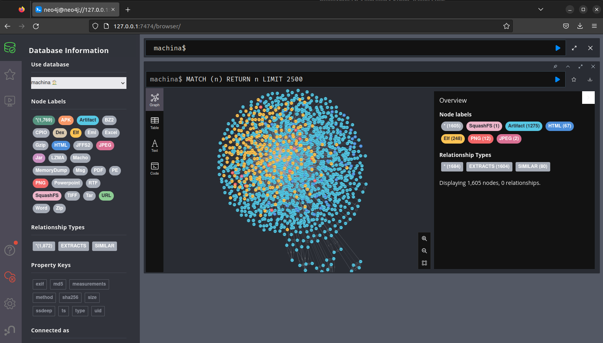

# Firmware (squashfs filesystem)

Obtain a sample of a squashfs file system:

```bash linenums="1"
wget https://github.com/ehrenb/machina-test/raw/main/data/squashfs/firmware.squashfs
```

Submit the file:

```bash linenums="1"
python3 bin/machinacli.py submit firmware.squashfs
```

After several minutes, all files in the submitted squashfs file are extracted and stored in Neo4J:

